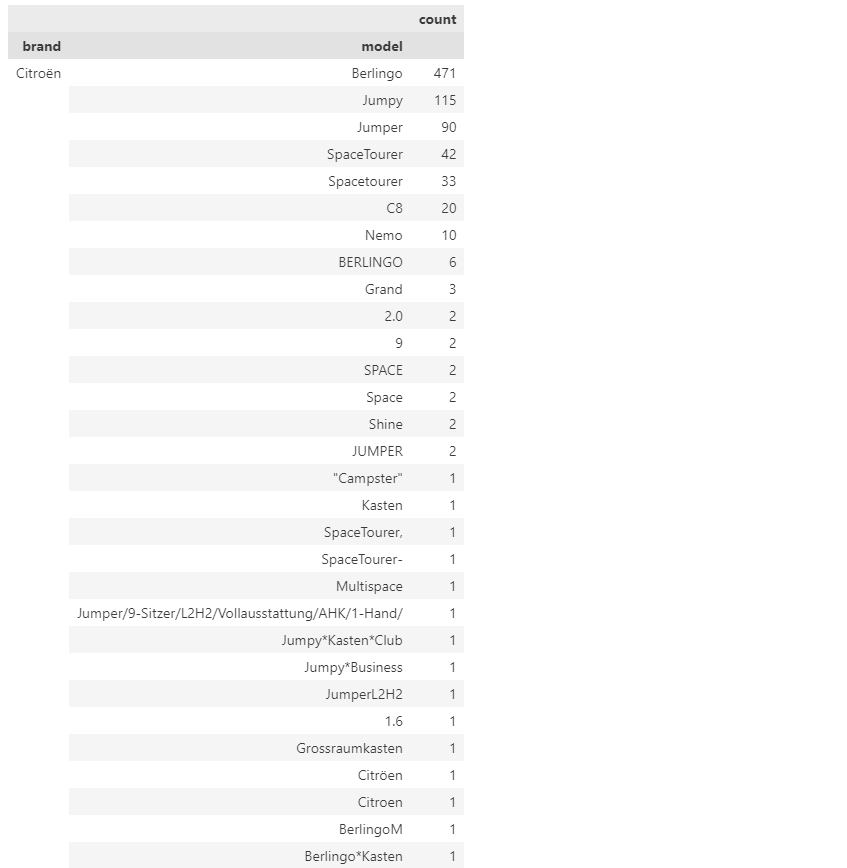

# Van price prediction

This project had two requirements: we had to use Machine Learning, and we had to get the data fully or at least partly webscraping.

Chosing the right topic was crucial: my priority was to chose a topic where I could get a good model, 'cause if after all the data cleaning I couldn't get a good model, all the work would have been in vain.

I thought about different topics that interest me, and in the end I though about predicting the price of a van, because all or almost all the variables have an effect on the price: brand, model, age, kms, fuel, seats, etc.

https://vanpricepredictor.streamlit.app/

Here's the link to the final predictor.

# **Webscraping**

The best website I could find was a german one (https://www.mobile.de/es), because it had the information very structured, unlike others, and I could apply a lot of filters to find the vehicles I wanted.

So I analyzed the information I could find in the general view and inside of every van, and I decided I had to enter every vehicle to get all the information I wanted. 

**Variables** - here is the information I wanted to get and the filters I applied:

``title``: original title where I can get the ``brand`` and ``model``

``price``: including the VAT (IVA in Spain)

``year``: I get it from the first registration of the van

``fuel``: only Diesel and Gasoline, which make almost 98% of the vehicles of the website

``km``

``power``: the horsepower in cv, missing in some vans.

``displacement``: the engine in cm3. I put a filter of minimum 1000 cm3 so I can always get the info, because I found out that in some vehicles they don't show it. It's related to the horsepower, maybe I don't need it, but I want to get it and then decide.

``consumption``: in L/100km, missing in some vehicles. I put a minimum of 3L/100km as a filter.

``seats``: missing sometimes, I filter to minimum 2 seats.
- 2: small cargo van
- 3: big cargo van
- 4: big passenger van, sometimes camperized, with the kitchen occupying one seat
- 5: small passenger van

``owners``: previous owners. Missing sometimes, I put a filter so I always get this info. 

``sliding doors``: mark any option (right, left and both-sided) to exclude cars. Vans either have or don't have a sliding left door, so actually left and both-sided should be the same. 

**Filters** - Some other filters I applied:
- Second hand vehicles to exclude new vehicles.
- Type: van
- Adds with images (in case I need to check information later, like the model)
- Damaged vehicles: don't show

## Webscraping Code
I had more challenges than what I expected, because the information was not perfectly structured, like the title was in two different formats.

Like I said, some information was missing, like the horsepower and the consumption, so I appended a NaN everytime it couldn't find it. 

Filtering for vans with only the rear right door, I had around 29.000 vans. Inside the specific van advertisement, I could change to the next van, so theorically I could run the code only once to scrape all 29.000 vans, but the reality was that when it reached the van number 2.000, it couldn't find the next button, so I had to run the code again.

I scrapped the vans in descending number of km, so I could track if it was trying to scrape a van already in my df, and I made it stop scraping it this happened so I wouldn't waste time, if accidentaly it had changed to a previous page, and also I knew from which van to continue just calculating the ``df.km.min()``

I compared if the van I was trying to scrape was already in df, and I skipped it in these cases, which happened quite often.

Whenever I finished one round of scraping, I saved the info into a df, which then I concatenated with the previous df that contained all the vans I had scrapped previously. 

I decided to scrape vans with more than 10.000km to put a limit, and I ended up with 21.738 vans. 

# **Data Cleaning**
Like I said before, from the date I could get the year, and then the ``age``, the variable which I'm really interested in.

I had only 7 nulls of ``power_cv`` and 2828 nulls of ``consumption``, which represent 13% of the dataset.

### ``title``

From the title I got the ``brand`` and ``model`` by assuming that in all the ads the first word is the brand and the second one is the model. In most of the cases it's like this, but not in all of them, so I had to check brand by brand the different models. 

Here's an example of the different models in the beginning and after the clean-up.

**Before**: 

**After**: 

The worst brand was **Ford**, because in most of the cases the model is not determined by the second word of the title. The most common second words were Transit and Tourneo, but both of these can vary in sizes (weither if it's Connect, Custom, etc.), therefore exisiting many different models. For the sake of simplicity, and because later I want to group again the models by size, I set 3 different models of Ford depending on the size: Transit, Custom and Connect.

Here is a picture with 4 different models, the 2 on the left being considered the same model, since they are roughly the same size.

I drop 4 brands that only had one model each and less than 4 vehicles per brand, not representative, I prefer simplifying the dataset.

In the beggining I had models from 24 brands, and I ended up with only **57 models from 12 brands.**

I started with 18.636 vehicles and finished with 17.721, meaning I dropped almost a thousand vehicles, which either they were cars or I couldn't find them again on the website.

## ``consumption``

I find there is a '--' value and many outliers that are wrong, so I change them manually looking for vans of the same characteristics. Let's take a look at the boxplot before and after:

## ``seats``

Same thing, I take a closer look at the outliers and I see that some of the values are wrong. 

Most of the vans have 5, 3 or 7 seats.

5 seats: Standard passenger van

3 seats: big cargo van

7 seats: big passenger van

## ``owners``

This is the only variable where the code failed, where it took values from another characteristic, so I have to check one by one to get the right values.

Most of the vans (71%) have had only one owner.

# **Exploratory Data Analysis**

### ``brand`` and ``model``: 

Most frequent models: 

Number of different models per brand:

Number of vans per brand:

### ``fuel``

Most of the vans (91,79%) run with diesel.

# **Data preprocessing**

Before advancing any further, I generate some graphs like scatterplots and a heatmap in order to find odd values, and generate some predictions.

In doing so, I realize that some predicted prices are negative. After some digging, I found that these vans with predicted negative prices are mostly due to one or more of the following reasons: 
- High mileage
- Old age
- Low horsepower

Of course, the model also tends to predict a negative price for vans that are actually cheap.

## Numerical variables

### ``price``

I had some outliers in the upper end, so I decide to drop them (only 9 vans). I also drop the 1% cheapest vans.

Let's take a look at the boxplot before and after:

The mean price is **29.527€**

### ``km``

Same thing, I had some outliers in the upper end, in this case I decide to drop only one van. 

Like I said before, thanks to the scatterplot I can find a van that its price doesn't follow the same patterns as the other vans, so I drop it as well. Let's take a look at the boxplot before and after:

The mean mileage is **106.963km**

I do the same thing with ``age`` and ``power_cv``

## Categorical variables

I get dummies of the following features:
- ``fuel``: Diesel or Gasoline 
- ``owners``: one or more
- ``sliding_doors``: right or both-sided

Going back to ``seats``, from the number of seats I can tell if a van is a cargo van (2 or 3 seats) or a passenger (4 or more seats), so I can get another dummy, ``cargo``.

Thanks to the extensive work I did on the brand and model, I can get 3 new categories: ``brand_price``, ``model_price`` and ``van_size``. It doesn't make sense the get dummies out of all the brands or models (remember, 12 brands and 57 models), but instead I separate the brands and models in 3 categories depending on their mean price, which I get from a groupby.

 

I do this because an expensive brand can also have affordable models, and viceversa, usually there is a model for every budget.

From the model I can also separate the vans in 3 different sizes.

With all these dummies I generate barplots against the price to see how they affect it. Here are some examples. 

   

With the heatmap we can observe the relationship between the distinct features and the price. 

# Machine Learning model

I train and test the following models: OLS, Ridge, Lasso, Polynomial Features, KNN and SVR. 

At the very beginning of the project I ran a simple OLS model to check the initial performance, and I got the following results:

- R2: 0.73272
- MSE: 96434466.68379
- MAPE: 41.14608%

After all the processing, with the same OLS I got these results:

- R2: 0.87235
- MSE: 43671531.53351
- MAPE: 25.48113%

We can see a clear improvement. I test all the models with the data untreated and scaled, and I can only see a difference in the KNN, which is the one that gives me the best results:

- R2: 0.93136
- MSE: 24085983.59092
- MAPE: 14.88392%

In making the predictions once again, I am glad to see that there are no negative predicted prices, and the distributions of the predicted prices and actual prices are very similar. 

